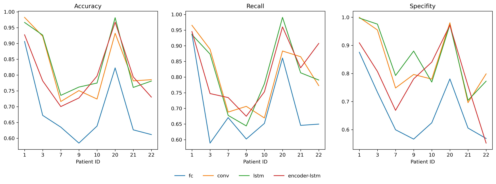
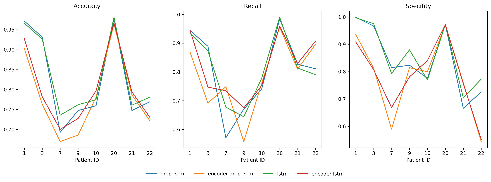

This project contains realizations of several neural-networks algorithms for predicting epileptic seizures using EEG data. Realization was done using PyTorch 1.10.2.

## Data
CHB-MIT dataset was used for learning and testing.
Data of patients (1, 3, 7, 9, 10, 20, 21, 22) were used. 
Algorithms were based on [1]. 
The preictal duration was chosen to be one hour before the seizure onset and interictal duration was chosen to be at least four hours
before or after any seizure as in. So it's important to note that huge interval which colored red on image below is skipped in data.
**Therefore this type of interval can produce unpredictibale results in real situaton.**
Data selection strategy was taken from the [1].

## Models
Models that were tested:
* Fully connected neural network
* Convolutional Neural Network
* Convolutional Neural Network + LSTM (no reccurent dropout)
* Convolutional Encoder + LSTM (no reccurent dropout)
* Convolutional Neural Network + LSTM (reccurent dropout)
* Convolutional Encoder + LSTM (reccurent dropout)

## The following results were obtained:

## Brief conclusions:
* Due to equalization the number of pre-ictical and interictal samples datasets for several patients were quite small. Train accuracy and loss were much better on such patients, so reccurent dropout was used to fight overfitting, but it didn't help much.
* Also Autoencoder was used over all dataset to learn features. MSE loss was used, and with normilized data minimum loss reached approximately 0.2 which is quite high.

## In plans:
 * In conv layers generally 3x2 kernels were used where time was in horizontal axis and eeg channels were on vertical axis. I assume that performance can be improved by changing kernel to 1d and compress data only over time axis. Maybe only in the end over channels.  

 * Also I'm plannig to test transformer model, it will change both autoencoder architecture and replace LSTM.

 * Denoising and detecting outliers

## Links:
[1] - [Efficient Epileptic Seizure Prediction Based on Deep Learning](https://ieeexplore.ieee.org/document/8765420)